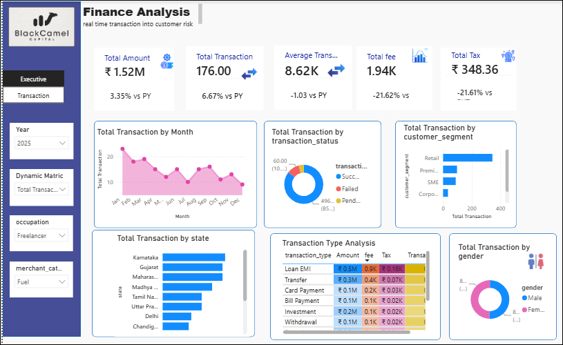
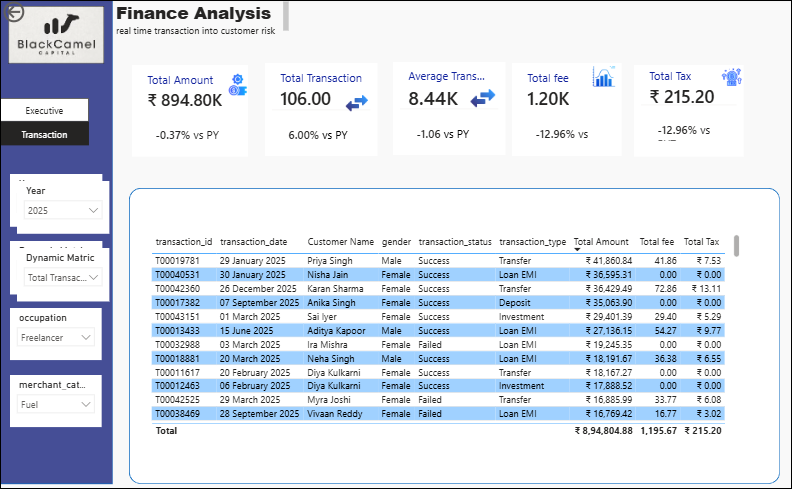
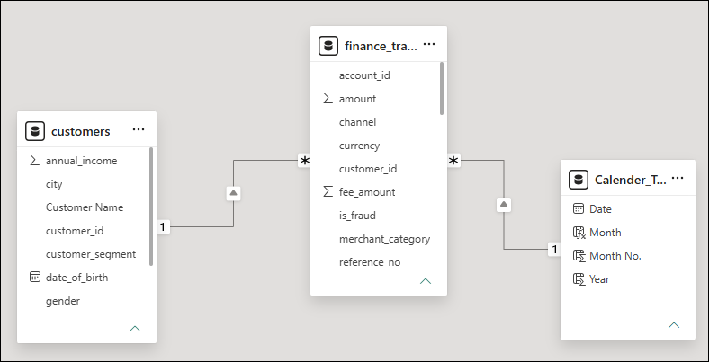
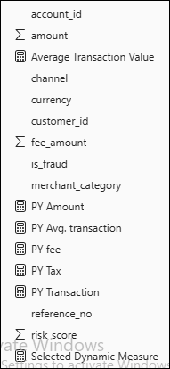
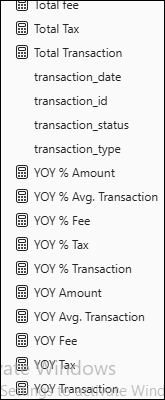

# 📊 Financial Analysis Dashboard | Power BI

Interactive Financial Analysis Dashboard built using **Power BI, DAX, Power Query, and Data Modeling** to analyze financial transactions, customer behavior, and business performance.

---

## 🚀 Project Overview

This Power BI project provides an interactive financial dashboard that enables businesses to monitor KPIs, analyze transaction trends, and gain actionable insights from customer financial data.

The dashboard includes:
- Executive Financial Dashboard
- Transaction Analysis Dashboard
- Interactive Filters & Slicers
- Time Intelligence Analysis
- Customer Segmentation
- State-wise Performance Analysis

---

## 🎯 Business Objective

The objective of this project is to:

- Analyze financial transactions
- Monitor key business KPIs
- Compare Current Year vs Previous Year performance
- Identify customer purchasing behavior
- Support data-driven business decisions

---

## 🛠️ Tools & Technologies

- Microsoft Power BI Desktop
- Power Query
- DAX (Data Analysis Expressions)
- Data Modeling
- Microsoft Excel

---

## 📂 Dataset

The project uses two datasets:

- finance_transactions.csv
- customers.csv

A Calendar Table was created for Time Intelligence calculations.

---

## 📊 Dashboard Features

### Executive Dashboard

- Total Amount
- Total Transactions
- Average Transaction
- Total Fee
- Total Tax
- Monthly Trend Analysis
- State-wise Transactions
- Customer Segmentation
- Gender Analysis
- Transaction Type Analysis

### Transaction Dashboard

- Detailed Transaction Records
- Interactive Filters
- Drill-through Analysis
- Dynamic Reporting

---

## 📐 Data Model

The project follows a **Star Schema**.

### Fact Table
- Finance_Transactions

### Dimension Tables
- Customers
- Calendar_Table

---

## 📈 DAX Measures

Key DAX calculations include:

- Total Amount
- Total Transactions
- Average Transaction
- Total Fee
- Total Tax
- Previous Year KPIs
- YoY Growth %
- Dynamic KPI Selection

---

## 💡 Key Business Insights

- Financial performance monitoring
- Customer transaction analysis
- Time-based trend analysis
- State-wise performance comparison
- Customer segmentation insights

---

## 📁 Repository Structure

```
Financial-Analysis-PowerBI
│
├── Financial_Analysis.pbix
├── Financial_Analysis_Dashboard_Project_Documentation.pdf
├── customers.csv
├── finance_transactions.csv
├── README.md
└── screenshots
```

---

## 📄 Documentation

A complete project documentation PDF is included in this repository explaining:

- Business Problem
- Dataset
- Dashboard Design
- Data Model
- DAX Measures
- Business Insights

---

## 👩‍💻 Author

**Farhana Roomy**

Power BI Developer | Data Analyst

🔗 LinkedIn:
https://www.linkedin.com/in/roomy-f-02185437a/
## 📷 Project Screenshots

### 📊 Executive Dashboard



### 📋 Transaction Dashboard



### 🗂️ Data Model



### 📐 DAX Measures

#### Measures - Part 1



#### Measures - Part 2


---

⭐ If you found this project helpful, please consider giving it a star.
